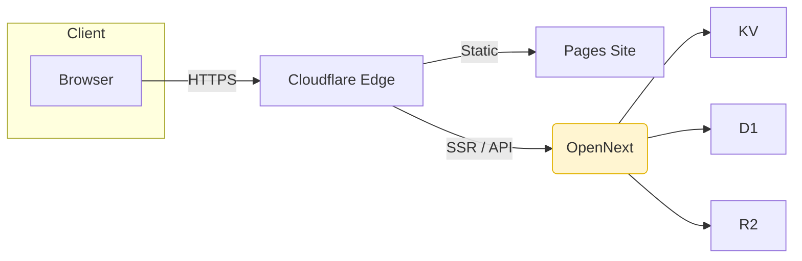

# Receptensite - Unified Specification (Cloudflare Free Tier)

> **Status:** v1.1 - 2025-05-22 • Consolidated from roadmap & requirements, including last review changes.

---

## 1. Technical stack

| Layer        | Technology                           | Version (LTS)        | Notes                                  |
| ------------ | ------------------------------------ | -------------------- | -------------------------------------- |
| Runtime      | **Cloudflare Workers**               | 2025-05 platform     | 10 ms CPU, 128 MB RAM (Free)           |
| Framework    | **Next.js**                          | **15**               | Upgrade via ADR when 16 becomes stable |
| UI           | React 18, shadcn/ui, Tailwind CSS ^3 |                      |                                        |
| TypeScript   | 5.x                                  | Strict mode enforced |                                        |
| DB           | Cloudflare **D1**                    | 1 GB storage         |                                        |
| Object store | Cloudflare **R2**                    | 10 GB storage        |                                        |
| Cache        | Workers KV                           |                      |                                        |
| Auth         | **Auth0** via next-auth              |                      |                                        |
| Tests        | **Vitest** + Testing Library         |                      |                                        |
| CI/CD        | GitHub Actions, Wrangler 3, OpenNext |                      |                                        |

---

## 2. Free tier limits & alerts

| Resource             | Free tier    | Alert threshold | Alert mechanism                |
| -------------------- | ------------ | --------------- | ------------------------------ |
| Workers requests     | 100k req/day | 90k             | Wrangler `limits` block        |
| Workers CPU          | 10 ms/req    | 8 ms p95        | Logflare chart + Slack webhook |
| **D1 reads**         | 450k/day     | 400k            | Analytics API script           |
| **D1 writes**        | 25k/day      | 22k             | same script                    |
| R2 storage           | 10 GB        | 9 GB            |                                |
| R2 egress            | 1 GB/day     | 800 MB          |                                |
| R2 operations        | 100k/day     | 90k             |                                |
| Turnstile challenges | 500k/mo      | 400k            | Cloudflare Analytics alert     |
| Pages build minutes  | 500 min/mo   | 400 min         | GitHub Actions usage API       |

Alerts are defined in `wrangler.toml`, and a daily cron Worker (`/ops/alert-forwarder`) sends Slack messages.

---

## 3. Domain & TLS

1. Use Cloudflare nameservers; set A/AAAA or CNAME records on orange cloud.
2. SSL/TLS -> Full Strict.
3. HSTS preload header: `max-age=63072000; includeSubDomains; preload`.
4. Automatic Certificate Management (ACM) for wildcard and apex; 90 day renewal.

---

## 4. Architecture

* **SSR scope:** only auth flows and personalised dashboard; all other routes are statically exported.
* **Image pipeline:** upload via presigned URL -> R2 -> Image Worker (Sharp) -> WebP 800 px, streaming, 4 MB object limit. *Load test story:* 10 parallel uploads x 4 MB before go live.

---

## 5. Performance budget (CI gate)

| Metric            | Budget    | Tool                    |
| ----------------- | --------- | ----------------------- |
| JS bundle         | <= 150 KB | `@next/bundle-analyzer` |
| CSS               | <= 30 KB  | `size-limit`            |
| Images (critical) | <= 500 KB | Lighthouse CI           |
| LCP               | <= 2.5 s  | Lighthouse CI           |
| CLS               | <= 0.10   | Lighthouse CI           |
| TBT               | <= 300 ms | Lighthouse CI           |

CI fails the build if any of these limits are exceeded.

---

## 6. Security

| Item        | Iteration                                                      | Detail                                        |
| ----------- | -------------------------------------------------------------- | --------------------------------------------- |
| **CSP**     | 0-2: report-only -> 3+: enforce                                | SHA hashes via `next-secure-headers`          |
| Turnstile   | Live plus offline fallback                                     | Switch to `?nocaptcha` when Turnstile is down |
| Rate limits | CF WAF: 200 req/10 s per IP on login routes                    |                                               |
| Headers     | Strict-Transport-Security, X-Frame-Options, Permissions-Policy |                                               |
| Secrets     | `wrangler secret put`; yearly rotation cron                    | Slack reminder via automations                |

---

## 7. Data management

* **Schema migrations:** Flyway style, validated by Vitest unit "migrations pass".
* **Backups:** **Weekly** D1 -> R2 SQL dump (cron: Sunday 00:00 UTC, gzip, 30 day retention).
* **JSON Import/Export:** iteration 3 export endpoint; import CLI script.

---

## 8. Observability & Ops

* **Logging:** Cloudflare Logs -> Workers Logpush -> Grafana Loki; PII scrub regex.
* **Usage dashboard:** Cloudflare Analytics API -> D1 and R2 metrics; Grafana board.
* **Alert forwarder Worker** (cron every 5 min) for limits in section 2.

---

## 9. Compliance (GDPR)

| Processor       | Region               | DPA / Link                                                                                                     |
| --------------- | -------------------- | -------------------------------------------------------------------------------------------------------------- |
| Cloudflare Inc. | EU regional services | [https://www.cloudflare.com/cloudflare-customer-dpa/](https://www.cloudflare.com/cloudflare-customer-dpa/)     |
| Auth0 (Okta)    | EU tenant            | [https://auth0.com/docs/legal/dpa](https://auth0.com/docs/legal/dpa)                                           |
| GitHub          | EU Data Boundary     | [https://docs.github.com/site-policy/privacy-policies/](https://docs.github.com/site-policy/privacy-policies/) |

Data flow diagram is in `/docs/compliance/data-map.drawio` (mermaid mirror).

---

## 10. Development Roadmap

### Iteration 0 - Project Bootstrap & Cloudflare Fundamentals

**Deliverables**

1. **Repository & tooling**

   * GitHub repo with trunk‑based branching
   * Node 22 LTS, pnpm workspace scripts
   * ESLint (TypeScript strict) and Prettier
   * Vitest for unit tests

2. **Wrangler & local stack**

   * Wrangler 3 with `.dev.vars` for secrets
   * Local D1 database and minio emulator for R2
   * Flyway style migration pattern in CI
   * Numbered migration files with versioning

3. **CI/CD skeleton**

   * GitHub Action: lint -> test -> build -> open‑next export
   * PR preview deploy to Cloudflare Pages
   * Deployment smoke tests

4. **Cloudflare resources (free tier)**

   * D1 database `etenbijelshof-db`
   * R2 bucket `etenbijelshof-images` (10 GB limit)
   * KV namespace `CACHE`
   * Worker subdomain reservation

5. **Auth0 tenant**

   * EU region tenant, social connectors disabled, optional MFA
   * Callback and issuer URLs registration

**Success Criteria**

* Minimal OpenNext worker responds `GET /healthz` -> `200 OK`
* Turnstile dev‑mode verification
* Complete project setup documentation

---

### Iteration 1 - Secure User Management & Basic UX

**Deliverables**

1. **next-auth + Auth0 integration**

   * Environment variables, session strategy (JWT 15 min sliding)
   * Middleware for protected routes and role check

2. **Invite‑only registration flow**

   * Admin page for token generation
   * Token validation in signup callback

3. **Basic UI layout & accessibility foundation**

   * Tailwind + shadcn/ui
   * Navigation, responsive breakpoints 320 px+
   * Basic accessibility (headings, alt tags, contrast)

4. **Error handling & logging setup**

   * Cloudflare Logs with PII filtering
   * Error boundaries and UI fallbacks

**Testing**: Cypress E2E for login, logout, invite flows

---

### Iteration 1b - Security & Performance Hardening

**Deliverables**

1. **OWASP checks & CSP setup**

   * Security headers in Next config
   * CSP in report‑only mode (escalate to enforce after Iteration 2)
   * Turnstile on public forms with failover testing
   * API rate limiting basics

2. **Performance budget implementation**

   * CI checks that block merges on budget violations
   * Baseline performance metrics establishment

3. **Basic documentation**

   * Authentication flow documentation
   * Core architecture technical docs

---

### Iteration 2 - Recipe CRUD & D1 Schema

**Deliverables**

1. **Database migrations & schema**

   * Deploy SQL schema via migration mechanism
   * Database schema documentation with ERD

2. **API routes / Server Actions**

   * Recipe CRUD endpoints with RBAC enforcement
   * Structured error responses
   * API documentation

3. **UI forms**

   * Rich ingredient and instructions fields
   * Client‑side validation with Zod
   * Accessible forms (ARIA labels, keyboard navigation)

4. **Edge cache implementation**

   * `getRecipe()` wrapper with KV cache (TTL 1 h)
   * Client‑side caching strategy

5. **Personalized dashboard** (SSR enabled for performance testing)

**Testing**: Unit and integration tests on CRUD operations

---

### Iteration 3 - Images & Performance

**Deliverables**

1. **Image upload endpoint**

   * Direct upload to R2 via presigned URL
   * Metadata storage with original and WebP variants

2. **Image processing Worker**

   * Sharp resize to 800 px, WebP conversion
   * 4 MB upload limit with streaming response
   * CPU and memory spike protection
   * Staging dataset testing before production

3. **Import/Export functionality**

   * JSON export and import with validation

4. **Core Web Vitals optimization**

   * Automatic performance checks in CI
   * CF Analytics ping endpoint integration
   * Real User Monitoring implementation

5. **Alert scripts & monitoring**

   * Wrangler alert configuration for resource limits
   * Email notifications for threshold breaches

**Testing**: Partial WCAG 2.2 AA check with axe‑core

---

### Iteration 4 - Search & Discovery

**Deliverables**

1. **LIKE based search API**

   * `/api/search?q=` endpoint with pagination
   * Error handling and rate limiting

2. **Filter UI**

   * Client‑side filter chips (tags, ingredients)
   * Accessible filter controls with keyboard support

3. **Random recipe & recommendations**

   * SQL `ORDER BY random()` with category fallback
   * Basic recommendation logic

4. **KV cache for search results**

   * TTL 10 min with cache invalidation strategy

**Testing**: E2E tests for search and filters

**Quality Assurance**

* Self review and dogfooding (use site for personal recipes)
* Mid project risk analysis and resource usage evaluation

---

### Iteration 5 - Shopping List & Print

**Deliverables**

1. **Client‑side list generator**

   * Recipe ingredients -> localStorage schema v1
   * Data persistence implementation

2. **Export to PDF**

   * `react-to-print` with print CSS
   * Cross browser testing

3. **Print‑friendly pages**

   * `@media print` stylesheet optimization
   * Toner saving and readability focus

4. **Step by step cooking mode**

   * Full screen navigation with swipe and keyboard
   * Mobile keep‑awake functionality

**Documentation**: User instructions for shopping list and print features

---

### Iteration 6 - Operational Hardening & Accessibility

**Deliverables**

1. **Complete WCAG 2.2 AA audit**

   * axe CI scan plus manual keyboard and screenreader testing
   * Accessibility issue resolution

2. **Advanced security measures**

   * CF WAF rules with path tier implementation
   * Fine tuned rate limiting per endpoint
   * CSP escalation to enforce mode

3. **Backup & monitoring**

   * **Weekly** D1 -> R2 backup Worker (cron trigger)
   * 30 day retention with restore procedure testing

4. **Dependency management**

   * Dependabot and Snyk alerts
   * Signed commits policy

**Documentation**: Final README and user documentation (ASCII clean Markdown)

---

### Iteration 7 - Future Proofing

**Deliverables**

1. **Roadmap checkpoint**

   * Resource usage analysis vs free tier limits
   * Upgrade path decision framework

2. **Architecture review**

   * Hotspot identification (image processing, database growth)
   * Architecture decision documentation

3. **Quality assessment**

   * AI assisted code review and suggestions
   * Technical debt evaluation and improvement plan

4. **Documentation finalization**

   * Complete technical design document
   * API documentation and troubleshooting guide

5. **Future exploration**

   * Workers AI image pipeline proof of concept (side branch only)
   * Cost analysis for potential upgrades

---

## 11. Definition of Done

Each task must meet these criteria:

* Code reviewed (AI assisted code review)
* Tests passing (unit, integration, E2E where applicable)
* Deploy preview on Cloudflare Pages
* Security validated (zero OWASP critical issues)
* Accessibility checked (basic compliance verified)
* Performance budget respected
* Documentation updated

## 12. Solo Developer Strategy

* AI Assisted Development
* Automated Testing
* Self Testing approach (dogfooding)
* Incremental Development
* Documentation Driven

## 13. Resource Monitoring Philosophy

* Proactive monitoring of free tier limits
* Alert thresholds at 80% and 90%
* Contingency planning for temporary overages
* Performance budget enforcement in CI pipeline

## 14. Architecture Decision Record (ADR) Triggers

* Version pinning changes
* Free tier limit changes
* Security policy updates
* Performance budget adjustments
